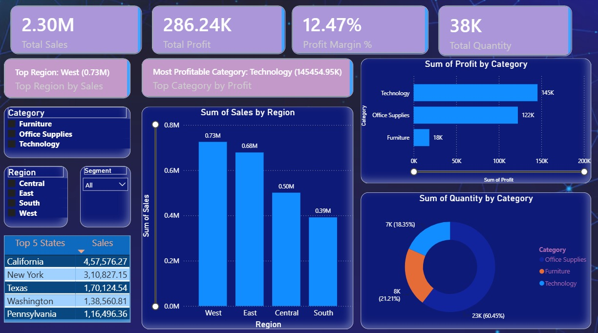

# Power BI Superstore Sales Dashboard

## Project Overview

An interactive Power BI dashboard created using the Superstore dataset to analyze sales, profit, quantity, regions, categories, and top-performing states.

## Key KPIs

- Total Sales: 2.30M
- Total Profit: 286.24K
- Profit Margin: 12.47%
- Total Quantity: 38K

## Dashboard Features

- Sales analysis by Region
- Profit analysis by Category
- Quantity distribution by Category
- Top 5 States by Sales
- Region and Category filters
- Segment filter
- TOOL TIPS USED
- Interactive dashboard
- Region drill-through analysis

## Tools Used

- Power BI
- Power Query
- DAX
- Data Visualization
- Data Analysis

## Dashboard Preview

